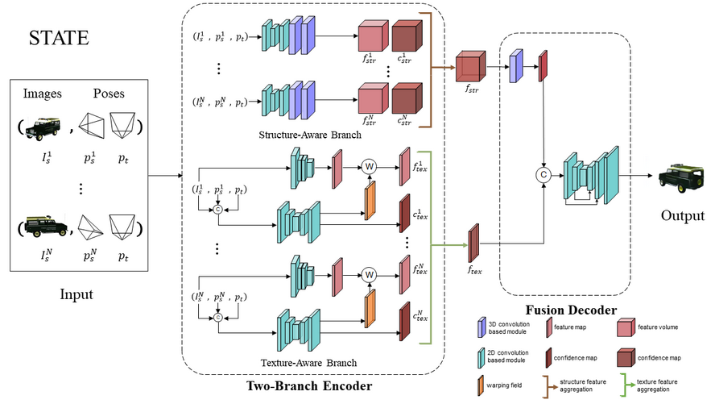

## Welcome to My Homepage

<link href="https://fonts.googleapis.com/css2?family=Open+Sans&display=swap"
      rel="stylesheet">
<link rel="stylesheet" type="text/css" href="./resources/style.css" media="screen"/>

<html lang="en">
<head>
	<title>This is my paper title</title>
    <!-- Facebook automatically scrapes this. Go to https://developers.facebook.com/tools/debug/
        if you update and want to force Facebook to re-scrape. -->
	<meta property="og:image" content="Path to my teaser.jpg"/>
	<meta property="og:title" content="Creative and Descriptive Paper Title." />
	<meta property="og:description" content="Paper description." />
    <!-- Twitter automatically scrapes this. Go to https://cards-dev.twitter.com/validator?
        if you update and want to force Twitter to re-scrape. -->
    <meta property="twitter:card"          content="summary" />
    <meta property="twitter:title"         content="Creative and Descriptive Paper Title." />
    <meta property="twitter:description"   content="Paper description." />
    <meta property="twitter:image"         content="Path to my teaser.jpg" />
    <meta name="viewport" content="width=device-width, initial-scale=1.0">

    <!-- Add your Google Analytics tag here -->
    
    

</head>

<body>

    

        Creative and Descriptive Paper Title
    

    

        In Conference 20XX
    

      

    

        <a href="https://en.wikipedia.org/wiki/James_J._Gibson">First Author</a>1
    

    

        <a href="https://en.wikipedia.org/wiki/James_J._Gibson">Second Author</a>2
    

    

        <a href="https://en.wikipedia.org/wiki/James_J._Gibson">Third Author</a>3
    

    

        <a href="https://en.wikipedia.org/wiki/James_J._Gibson">Fourth Author</a>4
    

    

        <a href="https://en.wikipedia.org/wiki/James_J._Gibson">Fifth Author</a>1
    

      

    
1&nbsp;Affiliation Number One

    
2&nbsp;Affiliation Number Two

    
3&nbsp;Affiliation Number Three

    
4&nbsp;Affiliation Number Four

      

    
<a href="">[Paper]</a>

    
<a href="https://www.youtube.com/watch?v=dQw4w9WgXcQ">[Video]</a>

    
<a href="https://github.com/elliottwu/webpage-template">[Code]</a>

      

    
     
    

        This template was originally made for <a href="http://richzhang.github.io/colorization/">
        Colorful Image Colorization</a>, and adapted to be mobile responsive by
        <a href="https://github.com/jasonyzhang/webpage-template">Jason Zhang</a>. Try resizing this webpage
        or opening it on your mobile device. The code can be found
        <a href="https://github.com/elliottwu/webpage-template">here</a>.
    

      
    

    <h1>Abstract</h1>
    

        This is my abstract.
    

      
    

    <h1>Video</h1>
    

        <iframe src="https://www.youtube.com/embed/dQw4w9WgXcQ" frameBorder="0"
                allow="accelerometer; autoplay; encrypted-media; gyroscope; picture-in-picture"
                allowfullscreen></iframe>
    

      
    

    <h1>Method Overview</h1>
    
     
    <a class="links" href="https://github.com/elliottwu/webpage-template">[Code]</a>

      
    

    <h1>Results</h1>
    

      
    

    <h1>Paper</h1>
    

        
    

    

        <h3>Creative and Descriptive Paper Title</h3>
        
First Author, Second Author, Third Author, Fourth Author, and Fifth Author

        
In Conference, 20XX.

        <pre><code>@InProceedings{author20XXtitle,
    title = {Creative and Descriptive Paper Title},
    author = {Author, First and Author, Second and Author, Third and Author, Fourth and Author, Fifth},
    booktitle = {Conference},
    year = {20XX},
}</code></pre>
    

      
    

    <h1>Acknowledgements</h1>
    

        This template was originally made by <a href="http://web.mit.edu/phillipi/">Phillip Isola</a>
        and <a href="http://richzhang.github.io/">Richard Zhang</a> for a
        <a href="http://richzhang.github.io/colorization/">colorful</a> ECCV project, and
        adapted to be mobile responsive by <a href="https://github.com/jasonyzhang/webpage-template">Jason Zhang</a>.
        The code can be found <a href="https://github.com/elliottwu/webpage-template">here</a>.
    

      

</body>

</html>

<table border="0">
  <tr>
    <td width="75%">
      <h1>Zhang, Jinsong</h1>
      
<b>Tianjin University</b>

      
<b>Email: jinszhang@tju.edu.cn</b>

    </td>
    <td width="25%">
            
    </td>
  </tr>
</table>

### About

My name is Jinsong Zhang. I am a master student from Tianjin University, under the supervision of Associate Professor [Kun Li](http://cic.tju.edu.cn/faculty/likun/index.html). I am about to receive my my Bachelor's degree from the school of Mathematic, TJU in 2018. My research interests are image generation, computer vision and computer graphic, etc.

### Education
- phd School of Tianjin College of Intelligence and Computing, Tianjin University (2021——）

- M.S. School of Tianjin International Engineering Institute, Tianjin University (September 2018—2021)(Pose Transfer)

- B.S. School of  Mathematics, Tianjin University (2014—2018)

  

### Publications

#### Conferences:

<table> <tbody> <tr> <td align="left" width=250>
</td>
<td align="left" width=550>PISE: Person Image Synthesis and Editing with Decoupled GAN. 
<a href="https://zhangjinso.github.io/"><b>Jinsong Zhang</b></a>, 
<a href="http://cic.tju.edu.cn/faculty/likun/index.html">Kun Li</a>, 
<a href="https://www.cardiff.ac.uk/people/view/118139-lai-yukun">Yu-Kun Lai</a>,
<a href="http://media.au.tsinghua.edu.cn/english/team/qhdai.html">Jingyu Yang</a> 
In CVPR 2021 
<a href="https://arxiv.org/abs/2103.04023">[Paper]</a> 
<a href="https://github.com/Zhangjinso/PISE">[Code]</a> 
<a href="http://cic.tju.edu.cn/faculty/likun/projects/PISE/index.html">[Project]</a>
</td></tr></tbody></table>

#### Journals:

<table> <tbody> <tr> <td align="left" width=250>
</td>
<td align="left" width=550>PoNA: Pose-guided Non-local Attention for Human Pose Transfer. 
<a href="http://cic.tju.edu.cn/faculty/likun/index.html">Kun Li</a>, 
<a href="https://zhangjinso.github.io/"><b>Jinsong Zhang</b></a>, 
<a href="http://liuyebin.com/">Yebin Liu</a>,
<a href="https://www.cardiff.ac.uk/people/view/118139-lai-yukun">Yu-Kun Lai</a>,
<a href="http://media.au.tsinghua.edu.cn/english/team/qhdai.html">Qionghai Dai</a> 
In TIP 2020 
<a href="https://arxiv.org/abs/2012.07049">[Paper]</a> 
<a href="https://github.com/Zhangjinso/PoNA">[Code]</a> 
<a href="http://cic.tju.edu.cn/faculty/likun/projects/PoseTrans_TIP/TIP2020.html">[Project]</a>
</td></tr></tbody></table>
 
<table> <tbody> <tr> <td align="left" width=250>
</td>
<td align="left" width=550>Human Pose Transfer by Adaptive Hierarchical Deformation. 
    <a href="https://zhangjinso.github.io/"> <b>Jinsong Zhang</b> </a>, 
Xingzi Liu,
  <a href="http://cic.tju.edu.cn/faculty/likun/index.html">Kun Li</a>  
In  Computer Graphic Forum (PG) 2020 
<a href="https://arxiv.org/abs/2012.06940">[Paper]</a> 
<a href="https://github.com/Zhangjinso/PINet_PG">[Code]</a> 
<a href="http://cic.tju.edu.cn/faculty/likun/projects/PoseTrans_pg/PINet.html">[Project]</a>
</td></tr></tbody></table>

<table> <tbody> <tr> <td align="left" width=250>
</td>
<td align="left" width=550>STATE: Learning Structure and Texture Representations for Novel View Synthesis. 
<a > Xinyi Jing</a>, 
  <a> Qiao Feng </a>,
  <a href="https://www.cardiff.ac.uk/people/view/118139-lai-yukun">Yu-Kun Lai</a>,
<a href="https://zhangjinso.github.io/"><b>Jinsong Zhang</b></a>, 
<a href="http://liuyebin.com/">Yebin Liu</a>,
<a>Yuanqiang Yu </a>,
<a href="http://cic.tju.edu.cn/faculty/likun/index.html">Kun Li</a>   
In CVM 2022 
<a href="http://cic.tju.edu.cn/faculty/likun/projects/STATE/assets/STATE_final.pdf">[Paper]</a> 
<a href="https://github.com/jingxinyi/STATE">[Code]</a> 
<a href="http://cic.tju.edu.cn/faculty/likun/projects/STATE/index.html">[Project]</a>
</td></tr></tbody></table>

#### Services

Reviewer of TIP, ACM.MM

